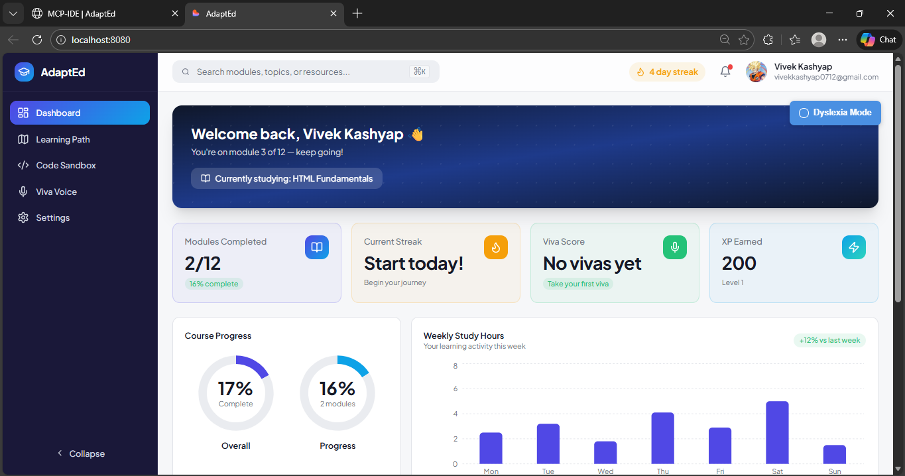
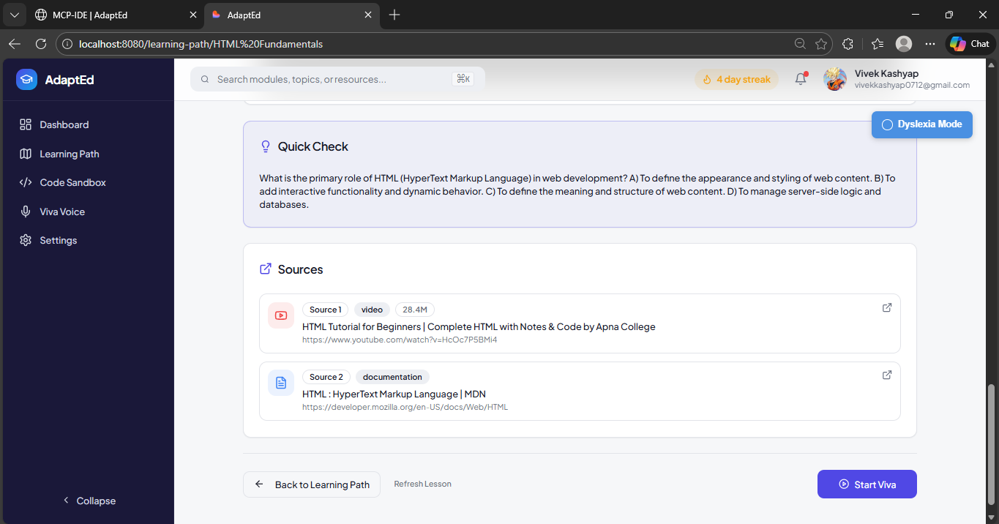
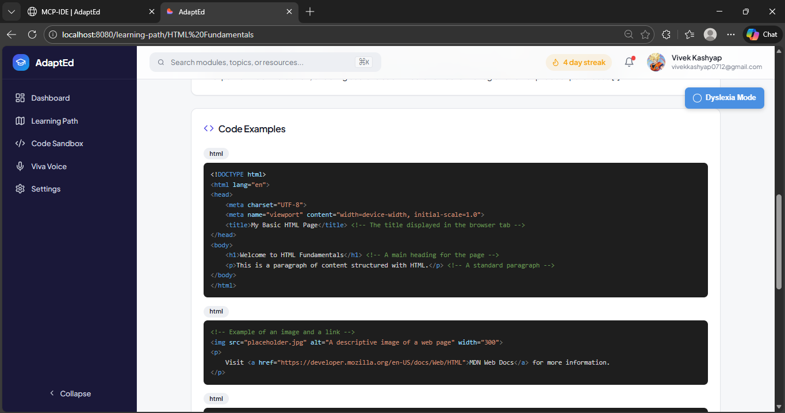
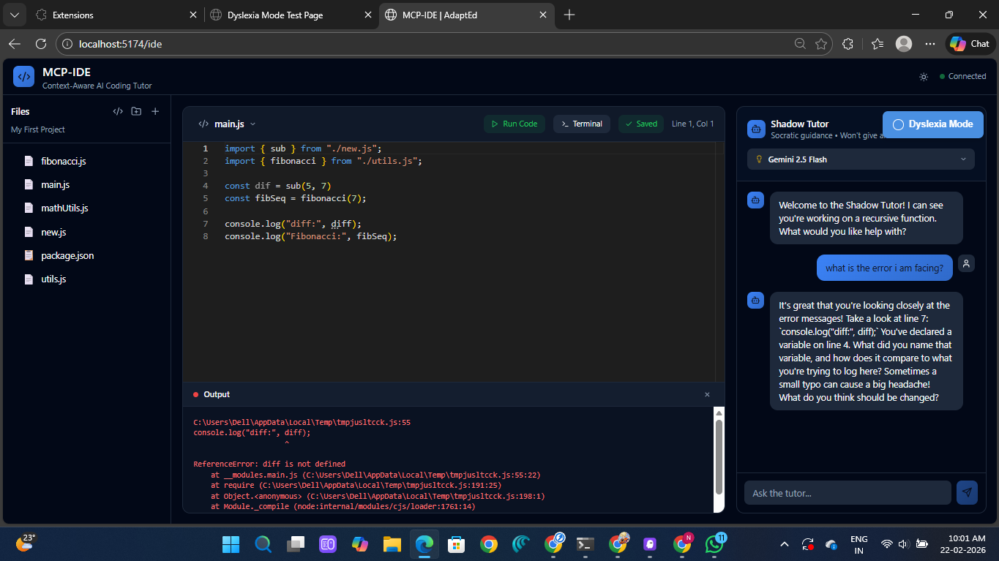
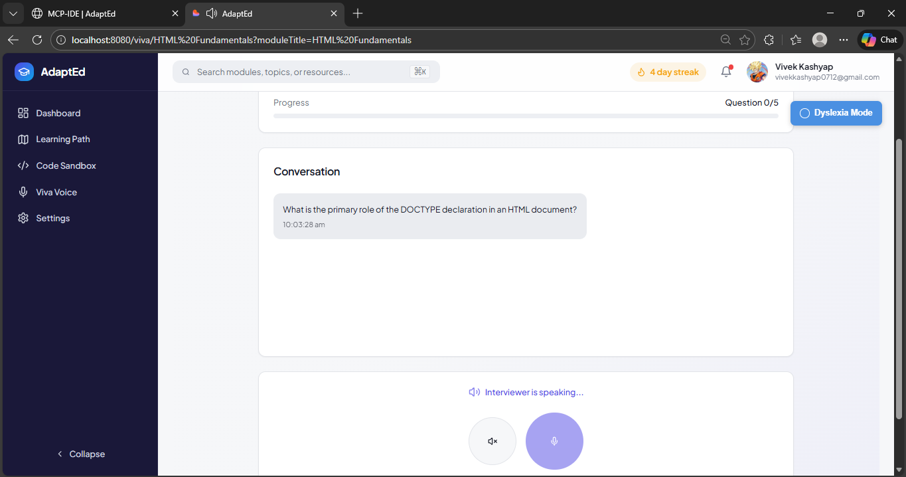
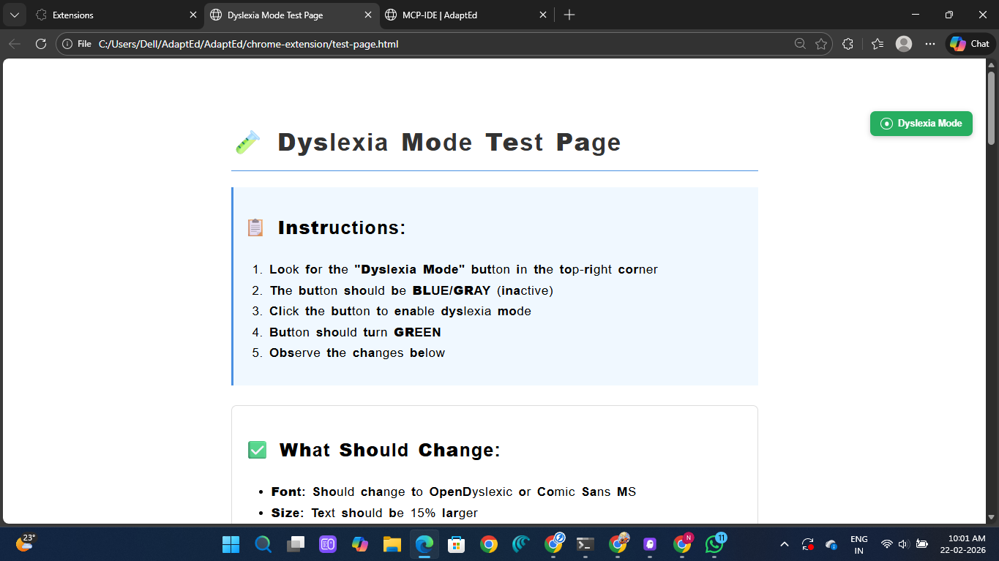

# AdaptEd - Adaptive Learning Platform

<div align="center">
  <h3>🎓 Personalized Learning • 🤖 AI-Powered • 💻 Hands-on Coding</h3>
  <p>An intelligent learning platform that adapts to your pace and learning style</p>
</div>

---

## 📸 Screenshots

### Dashboard - Learning Progress Overview

*Track your learning progress, streaks, XP, and upcoming modules*

### AI-Generated Lessons with Multi-Source Citations

*Lessons synthesized from multiple sources with Perplexity-style attribution*

### Comprehensive Study Notes

*AI-generated study notes with key takeaways and practice exercises*

### MCP-IDE - Integrated Development Environment

*Full-featured code editor with AI tutor, multi-file support, and real-time execution*

### Viva Voice - Voice-Based Examinations

*Interactive voice assessments with speech-to-text and AI evaluation*

### Dyslexia-Friendly Mode

*Chrome extension providing accessible reading experience with OpenDyslexic font*

---

## 🌟 Overview

AdaptEd is a comprehensive learning platform that adapts to each student's needs, providing:
- **Personalized Learning Roadmaps** - AI-generated paths based on your goals and current skills
- **Interactive Lessons** - Rich content with videos, documentation, and hands-on exercises
- **Viva Voice Examinations** - Voice-based assessments to test understanding
- **Code Sandbox (MCP-IDE)** - Full-featured IDE with AI tutor for coding practice
- **Progress Tracking** - Detailed analytics, streaks, XP, and achievements
- **Accessibility Features** - Dyslexia-friendly mode via Chrome extension

## 📁 Project Structure

```
AdaptEd/
├── frontend/              # Main React frontend (Port 5173)
├── backend/              # Python FastAPI backend (Port 8001)
├── mcp-ide/              # Integrated coding environment
│   ├── frontend/         # IDE React frontend (Port 5174)
│   └── backend/          # IDE Python backend (Port 8000)
├── sample-frontend/      # Demo/template frontend (Port 8080)
├── chrome-extension/     # Dyslexia mode extension
└── docs/                 # Documentation

```

## 🚀 Quick Start

### Prerequisites

- **Node.js** 18+ and npm
- **Python** 3.8+
- **Git**
- **Google Gemini API Key** (for AI features)
- **Supabase Account** (for MCP-IDE database)
- **Firebase Account** (for authentication)

### Installation

#### 1. Clone the Repository
```bash
git clone <repository-url>
cd AdaptEd
```

#### 2. Setup Main Frontend
```bash
cd frontend
npm install
cp .env.example .env
# Edit .env and add your Firebase credentials
npm run dev  # Runs on http://localhost:5173
```

#### 3. Setup Main Backend
```bash
cd backend
python -m venv venv
venv\Scripts\activate  # Windows
# source venv/bin/activate  # Mac/Linux
pip install -r requirements.txt
cp .env.example .env
# Edit .env and add your API keys
python -m uvicorn main:app --reload --port 8001
```

#### 4. Setup MCP-IDE Frontend
```bash
cd mcp-ide/frontend
npm install
npm run dev  # Runs on http://localhost:5174
```

#### 5. Setup MCP-IDE Backend
```bash
cd mcp-ide/backend
python -m venv venv
venv\Scripts\activate  # Windows
pip install -r requirements.txt
cp .env.example .env
# Edit .env and add Supabase credentials
python -m uvicorn app.main:app --reload --port 8000
```

#### 6. Setup Chrome Extension (Optional)
```bash
# Load unpacked extension in Chrome
# 1. Go to chrome://extensions/
# 2. Enable "Developer mode"
# 3. Click "Load unpacked"
# 4. Select AdaptEd/chrome-extension folder
```

## 🎯 Features

### 1. Personalized Learning Roadmaps
- AI-generated learning paths based on your career goals
- Adaptive content that skips what you already know
- Weekly module structure with clear progression
- Support for multiple tech stacks (Full-Stack, Frontend, Backend, DevOps, etc.)

### 2. Interactive Lessons
- Rich content with multiple sources:
  - YouTube video tutorials
  - MDN documentation
  - Interactive examples
- AI-generated lesson content using Google Gemini
- Progress tracking per module
- Note-taking and bookmarking

### 3. Viva Voice Examinations
- Voice-based Q&A assessments
- 5 questions per module
- Pass threshold: 60%
- Speech recognition using Web Speech API
- AI-powered evaluation
- Works offline with mock data

### 4. Code Sandbox (MCP-IDE)
- Full-featured code editor with Monaco
- Multi-file support with file explorer
- AI coding tutor (Shadow Tutor)
- Code execution for JavaScript, Python, C++
- Terminal integration
- Code history and snapshots
- RAG-powered context-aware assistance
- Embedded in main app or standalone

### 5. Progress Dashboard
- Module completion tracking
- Streak counter
- XP and leveling system
- Viva score analytics
- Weekly activity charts
- Achievement badges

### 6. Accessibility
- Dyslexia-friendly mode
- Chrome extension for web-wide support
- Customizable fonts and spacing
- High contrast options

## 🔧 Configuration

### Environment Variables

#### Main Frontend (.env)
```env
VITE_FIREBASE_API_KEY=your_firebase_api_key
VITE_FIREBASE_AUTH_DOMAIN=your_project.firebaseapp.com
VITE_FIREBASE_PROJECT_ID=your_project_id
VITE_FIREBASE_STORAGE_BUCKET=your_project.appspot.com
VITE_FIREBASE_MESSAGING_SENDER_ID=your_sender_id
VITE_FIREBASE_APP_ID=your_app_id
VITE_API_URL=http://localhost:8001
```

#### Main Backend (.env)
```env
GEMINI_API_KEY=your_gemini_api_key
YOUTUBE_API_KEY=your_youtube_api_key
GROQ_API_KEY=your_groq_api_key
```

#### MCP-IDE Backend (.env)
```env
SUPABASE_URL=your_supabase_url
SUPABASE_KEY=your_supabase_anon_key
GEMINI_API_KEY=your_gemini_api_key
```

### Port Configuration

| Service | Port | URL |
|---------|------|-----|
| Main Frontend | 5173 | http://localhost:5173 |
| Main Backend | 8001 | http://localhost:8001 |
| MCP-IDE Frontend | 5174 | http://localhost:5174 |
| MCP-IDE Backend | 8000 | http://localhost:8000 |
| Sample Frontend | 8080 | http://localhost:8080 |

## 📚 API Documentation

### Main Backend Endpoints

#### Roadmap Generation
```
POST /generate-roadmap
Body: { goal, current_skills, time_commitment }
```

#### Lesson Content
```
POST /generate-lesson-content
Body: { topic, module_title, week }
```

#### Viva Examinations
```
POST /viva/start-simple?module_topic=...&user_goal=...
POST /viva/chat
Body: { session_id, user_text, module_topic }
POST /viva/complete
Body: { user_id, module_id, final_score }
```

### MCP-IDE Backend Endpoints

#### File Management
```
GET /api/v1/files/projects
POST /api/v1/files/files
GET /api/v1/files/files/{file_id}
PATCH /api/v1/files/files/{file_id}
```

#### Code Execution
```
POST /api/v1/executor/run
Body: { code, language, project_id, file_path }
```

#### AI Tutor
```
POST /api/v1/tutor/ask
Body: { editor_state, user_question, model_type }
```

## 🎨 Tech Stack

### Frontend
- **React** 18 with TypeScript
- **Vite** for build tooling
- **TailwindCSS** for styling
- **Framer Motion** for animations
- **Monaco Editor** for code editing
- **React Query** for data fetching
- **React Router** for navigation
- **Firebase** for authentication

### Backend
- **FastAPI** (Python)
- **Google Gemini** for AI generation
- **Groq** for speech-to-text (Whisper)
- **YouTube API** for video search
- **Supabase** for database (MCP-IDE)
- **PostgreSQL** with pgvector for embeddings

### AI/ML
- **Google Gemini 1.5 Flash** - Content generation
- **Groq Whisper-v3** - Speech recognition
- **Sentence Transformers** - Code embeddings
- **RAG** - Context-aware tutoring

## 🧪 Testing

### Frontend
```bash
cd frontend
npm run test
npm run test:coverage
```

### Backend
```bash
cd backend
pytest
pytest --cov
```

### MCP-IDE
```bash
cd mcp-ide/backend
pytest tests/
```

## 📖 User Guide

### Getting Started

1. **Sign Up/Login** - Use Google authentication
2. **Onboarding** - Set your learning goal and current skills
3. **Roadmap Generation** - AI creates your personalized path
4. **Start Learning** - Follow modules week by week
5. **Take Vivas** - Pass voice exams to unlock next modules
6. **Practice Coding** - Use Code Sandbox for hands-on practice

### Taking a Viva

1. Navigate to "Viva Voice" in sidebar
2. Select a module you've completed
3. Click "Start Viva"
4. Answer 5 questions using voice or text
5. Get instant feedback and scoring
6. Pass with 60% or higher

### Using Code Sandbox

1. Click "Code Sandbox" in sidebar
2. MCP-IDE loads in embedded view
3. Create files, write code, run programs
4. Ask AI tutor for help
5. Click maximize for fullscreen mode

## 🔒 Security

- Firebase Authentication for user management
- API key validation on all endpoints
- CORS configuration for cross-origin requests
- Environment variables for sensitive data
- No PII stored in code or logs

## 🐛 Troubleshooting

### Frontend won't start
```bash
# Clear node_modules and reinstall
rm -rf node_modules package-lock.json
npm install
```

### Backend API errors
```bash
# Check if API keys are set
cat backend/.env
# Restart backend
python -m uvicorn main:app --reload --port 8001
```

### MCP-IDE not loading
- Verify MCP-IDE frontend is running on port 5174
- Check browser console for CORS errors
- Ensure Supabase credentials are correct

### Viva not working
- Check if main backend is running on port 8001
- Verify GROQ_API_KEY is set for speech-to-text
- Test with text input first (fallback mode)

## 📝 Development

### Adding a New Feature

1. Create a branch: `git checkout -b feature/your-feature`
2. Make changes
3. Test thoroughly
4. Commit: `git commit -m "Add: your feature"`
5. Push: `git push origin feature/your-feature`
6. Create Pull Request

### Code Style

- **Frontend**: ESLint + Prettier
- **Backend**: Black + Flake8
- **Commits**: Conventional Commits format

### Database Migrations (MCP-IDE)

```bash
cd mcp-ide/database
# Run migration SQL files in Supabase SQL editor
```

## 🤝 Contributing

Contributions are welcome! Please:
1. Fork the repository
2. Create a feature branch
3. Make your changes
4. Add tests
5. Submit a pull request

## 📄 License

[Your License Here]

## 👥 Team

[Your Team Information]

## 🙏 Acknowledgments

- Google Gemini for AI capabilities
- Supabase for database infrastructure
- Firebase for authentication
- Monaco Editor for code editing
- All open-source contributors

## 📞 Support

- **Issues**: [GitHub Issues]
- **Email**: [support@adapted.com]
- **Docs**: [Documentation Site]

## 🗺️ Roadmap

### Current Version (v1.0)
- ✅ Personalized roadmaps
- ✅ Interactive lessons
- ✅ Viva examinations
- ✅ Code sandbox
- ✅ Progress tracking

### Upcoming Features
- 🔄 Mobile app
- 🔄 Collaborative coding
- 🔄 Live mentorship
- 🔄 Certificate generation
- 🔄 Community forums

## 📊 Project Stats

- **Lines of Code**: ~50,000+
- **Components**: 100+
- **API Endpoints**: 30+
- **Supported Languages**: JavaScript, Python, C++
- **AI Models**: 3 (Gemini, Whisper, Embeddings)

---

Made with ❤️ by the AdaptEd Team
